## Solid-Liquid Interfacial Electrochemistry

We investigate how divalent ions (Mg²⁺, Zn²⁺, Ca²⁺) interact with electrochemical interfaces at the molecular level. By understanding and designing the ion's solvation structure, we control whether it crosses an interface, what it forms when it arrives, and whether a desired reaction proceeds selectively in different electrochemical applications like batteries, electrochemical reduction and selective ion separation.

## Solid-Solid Interfacial Electrochemistry

Solid-state batteries promise higher safety and energy density. Our research focuses on understanding and controlling solid–solid interface electrochemistry through an integrated experimental and computational approach. We are particularly interested in how local chemical environments, short-range structural heterogeneity, and electro-chemo-mechanical coupling collectively determine ion transport and interfacial stability across buried interfaces. Our goal is to develop scientifically grounded interface design principles that enable high-energy-density, long-lifetime, and mechanically robust solid-state batteries.

## Automated Device Assembly & Characterization 

We focuses on developing standardized and automated workflows for solid-state battery fabrication and testing. The platform integrates automated cell assembly, pressure control, and electrochemical characterization to enable systematic studies of solid electrolytes and interfaces. This infrastructure accelerates materials discovery while providing a foundation for reproducible and data-driven research for solid-state battery or other forms of energy devices. 

