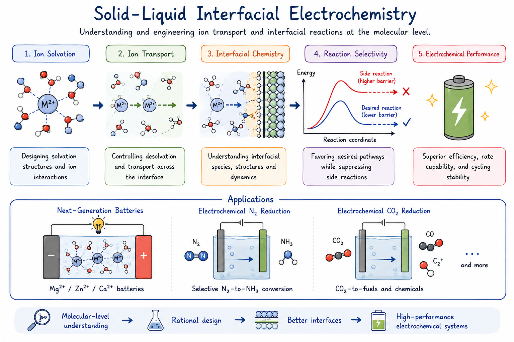
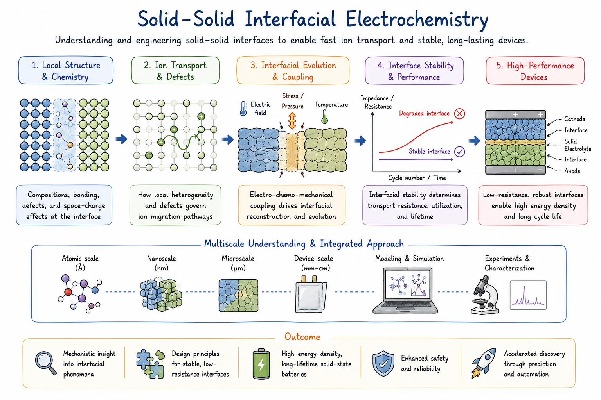
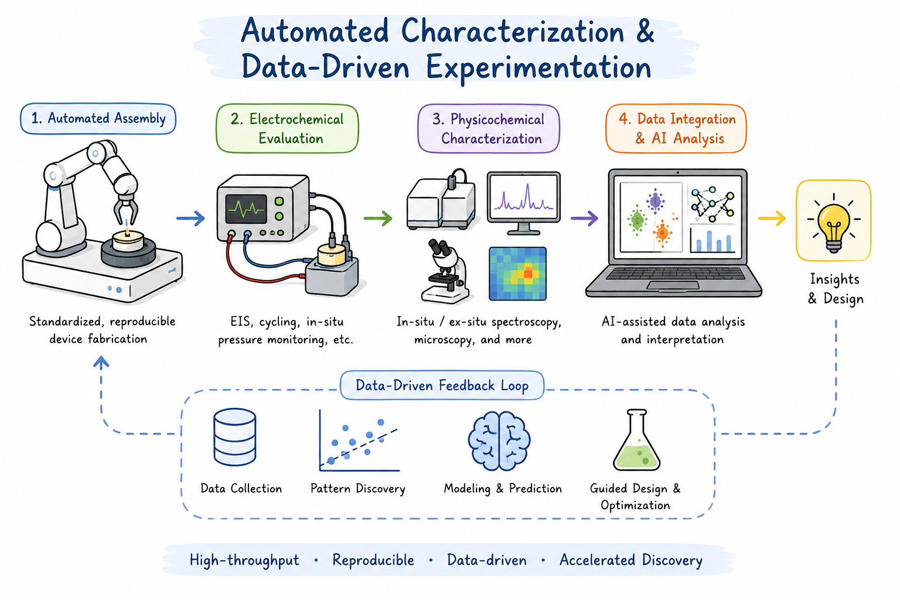

## Solid-Liquid Interfacial Electrochemistry

We investigate how ion solvation, transport, and interfacial chemistry govern electrochemical processes at solid–liquid interfaces, with a particular emphasis on multivalent ions such as magnesium, calcium, and zinc ions. By understanding and manipulating the local solvation environment, ion–ion interactions, and interfacial dynamics, we seek to control how ions approach and cross an interface, what interfacial species they form, and which reaction pathways become thermodynamically and kinetically accessible.

These molecular-level insights guide the rational design of electrolytes and interfaces for next-generation batteries, electrochemical nitrogen and carbon dioxide conversion, and other selective electrochemical processes. Ultimately, we aim to establish general design principles that connect electrolyte chemistry and interfacial structure with ion transport, reaction selectivity, and electrochemical performance.

## Solid-Solid Interfacial Electrochemistry

Solid-state electrochemical systems introduce a fundamentally different interfacial environment, where ion transport and electrochemical reactions are intimately coupled with local structure, chemical heterogeneity, and mechanical evolution. We investigate these coupled processes across buried solid–solid interfaces through an integrated approach combining materials synthesis, advanced characterization, electrochemical measurements, and computational modeling.

A particular focus is understanding how local chemical environments, short-range structural heterogeneity, defects and vacancies, and electro-chemo-mechanical coupling govern ion transport and interfacial stability at both cathode–electrolyte and anode–electrolyte interfaces. By connecting atomic- and nanoscale interfacial phenomena with macroscopic electrochemical behavior, we aim to establish predictive design principles for high-energy-density, long-lived, and mechanically robust solid-state batteries and related electrochemical devices.

## Automated Characterization & Data-Driven Experimentation 

We develop automated and data-driven experimental platforms for electrochemical device assembly, electrochemical evaluation, and physicochemical characterization. By integrating standardized fabrication with electrochemical, mechanical, and spectroscopic measurements, we seek to establish quantitative relationships between interfacial properties, dynamic ion transport, and device performance under well-controlled conditions.

We are particularly interested in advancing automated in situ characterization workflows and integrating them with AI-assisted data analysis and interpretation. By transforming complex experimental measurements into chemically and physically meaningful descriptors, we aim to accelerate the understanding and rational design of electrolytes, interfaces, and functional materials. Together, these efforts provide a foundation for high-throughput, reproducible, and data-driven materials research.

