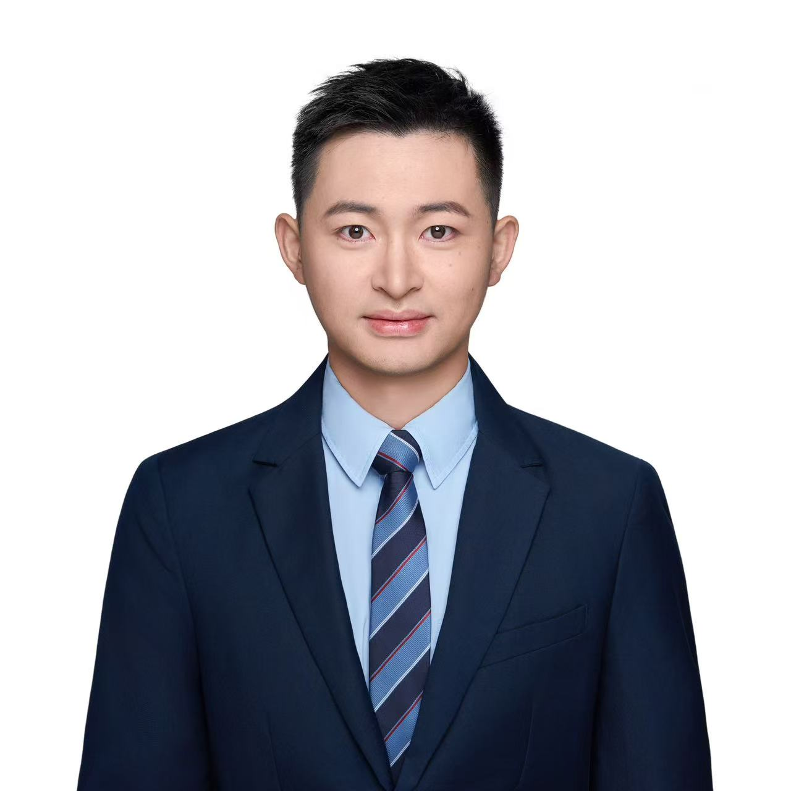

## Chang Li, Principal Investigator

:::::: team-grid
::: team-background
### Background

- 2027–Present — Assistant Professor, Westlake University
- 2024–2026 — Postdoc, Lawrence Berkeley National Laboratory
- 2019–2024 — Ph.D. in Chemistry, University of Waterloo
- 2015–2019 — B.Eng. in Materials Science and Engineering, HUST
:::

::: team-links
### Links

- [lichang\@westlake.edu.cn](mailto:lichang@westlake.edu.cn){.email}
- 📚 [Google Scholar](https://scholar.google.com/citations?user=nvmiWvoAAAAJ&hl=en)
- <a href="https://orcid.org/0000-0001-5420-3856">  ORCID </a>
- Office: H6
:::

::: team-photo
{width="220px"}
:::
::::::

## Postdoc

::::: team-grid
::: team-background
### Alex

- Year in joining group: 2027
- Education: Ph.D. in Traveling (2026, University of Independence)
- Research Interests: Solid state batteries
- About Me: I like eating
:::

::: team-photo
{width="220px"} [alex\@westlake.edu.cn](mailto:alex@westlake.edu.cn){.email}
:::
:::::

## Student

::::: team-grid
::: team-background
### LYZ

- Year in joining group: 2027
- Education: B.Eng. in Exploring (2026, University of Curiosity)
- Research Interests: Mg batteries
- About Me: I like cooking
:::

::: team-photo
{width="220px"} [lyz\@westlake.edu.cn](mailto:lyz@westlake.edu.cn){.email}
:::
:::::

## Research Assistant

::::: team-grid
::: team-background
### YZ A. Li

- Year in joining group: 2027
- Education: B.Eng. in Jumping (2026, University of Courage)
- Research Interests: Automation
- About Me: I like robots
:::

::: team-photo
{width="220px"} [yal\@westlake.edu.cn](mailto:yal@westlake.edu.cn){.email}
:::
:::::