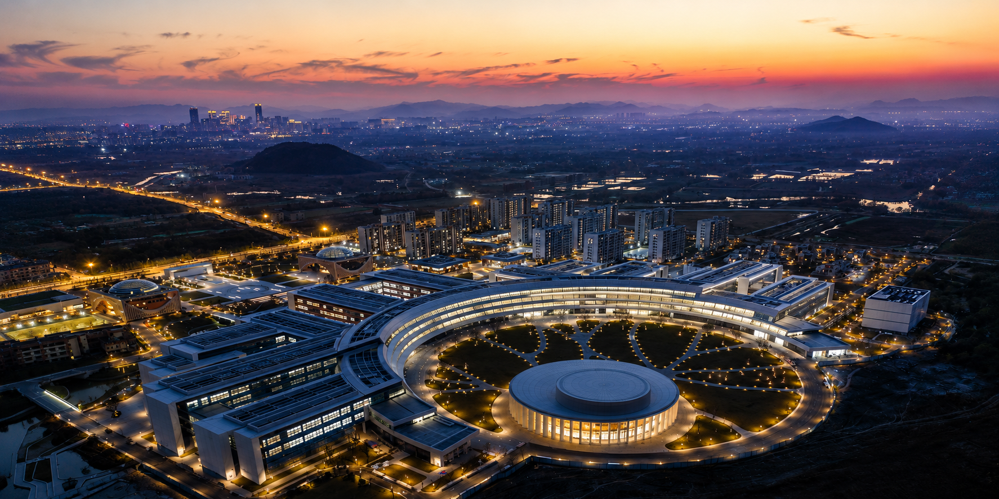

{.homepage-hero}

::: {#hero-heading}

The **Interfacial Electrochemical Engineering Laboratory (IEE Lab)** is part of the [Center for Advanced Engineering Sciences and Technology (CAEST)](https://en-soe.westlake.edu.cn/OurSchool/departmentcenter/centerCAEST/) in the [School of Engineering](https://en-soe.westlake.edu.cn/index.shtml) at [Westlake University](https://en.westlake.edu.cn/). We seek to understand and engineer ion transport and interfacial processes that govern electrochemical energy storage and conversion.

Our research spans **liquid–solid and solid–solid interfaces**, with particular interests in next-generation batteries, electrochemical nitrogen and carbon dioxide conversion, and related electrochemical systems. By uncovering how local chemistry, structure, and dynamics regulate ion transport and interfacial reactions, we aim to establish fundamental design principles that translate **atomic- and molecular-scale understanding into materials and device-level performance**.

To achieve this, we integrate advanced characterization, materials and electrolyte design, and computational methods to systematically investigate complex electrochemical systems across multiple length and time scales. A particular focus is the development of **automated *in-situ* characterization platforms coupled with AI-assisted data analysis and interpretation**, enabling high-throughput experimentation and accelerating scientific discovery. Through these efforts, we aim to advance electrochemical technologies for sustainable energy storage, chemical production, and resource utilization.

We foster a **collaborative and curiosity-driven research environment** where researchers from diverse backgrounds work across the boundaries of electrochemistry, materials science, chemistry, physics, and engineering to advance interfacial electrochemistry for a sustainable energy future.

**Interested in joining us?** Opportunities for prospective graduate students, postdoctoral researchers, and research assistants can be found [here](Openings.qmd).
:::

## News

::: {.news-item}
{width=220px}

**January 2027**  
The Interfacial Electrochemical Engineering Lab officially launches at Westlake University.
:::

## Photos
