## Journal Publications

†: equal contribution; 📧: corresponding author

### 2027

- To be updated

### Before joining Westlake

:::: pub-item
<a href="publications/BeforeJoiningWestlake/Eutectic-Zn-MnO2_NatEng2026.pdf" target="_blank"> 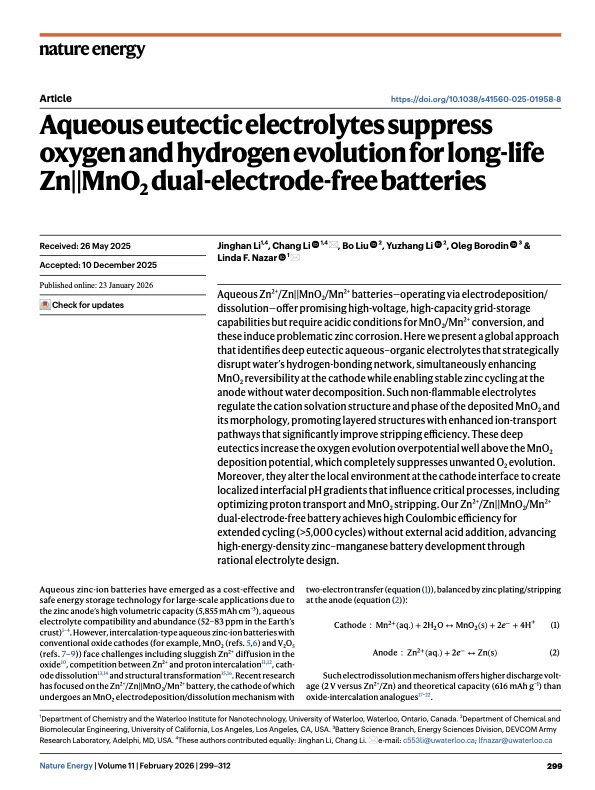 </a>

::: pub-text
<strong> Jinghan Li†, Chang Li†📧, Bo Liu, Yuzhang Li and Linda F. Nazar📧</strong>  <em> Aqueous eutectic electrolytes suppress oxygen and hydrogen evolution for long-life Zn\|\|MnO2 dual-electrode-free batteries </em>  Nat. Energy 2026, [DOI: 10.1038/s41560-025-01958-8](https://www.nature.com/articles/s41560-025-01958-8)
:::
::::

:::: pub-item
<a href="publications/BeforeJoiningWestlake/Steric-effect-Mg-electrolytes-JACS-2026.pdf" target="_blank"> 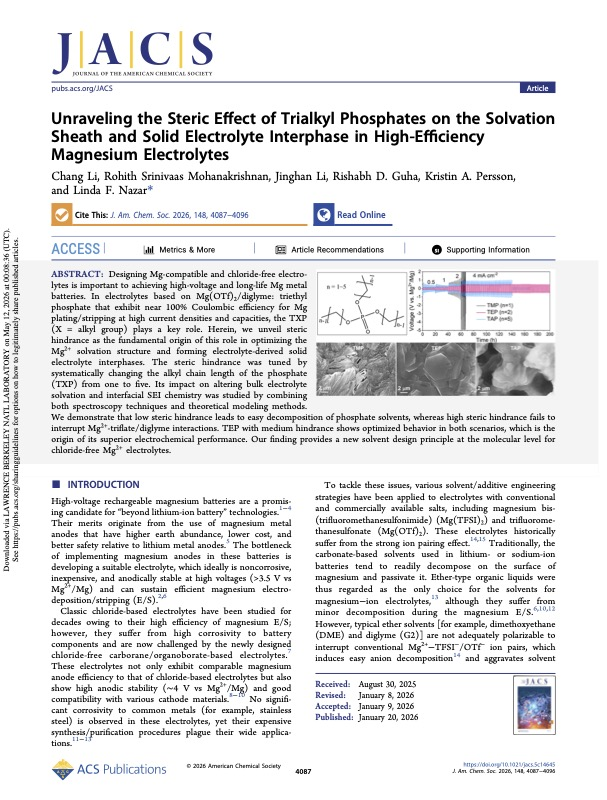 </a>

::: pub-text
<strong> Chang Li, Rohith Srinivaas Mohanakrishnan, Jinghan Li, Rishabh D. Guha, Kristin A. Persson and Linda F. Nazar📧</strong>  <em> Unraveling the Steric Effect of Trialkyl Phosphates on the Solvation Sheath and Solid Electrolyte Interphase in High-Efficiency Magnesium Electrolytes </em>  J. Am. Chem. Soc. 2026, [DOI: 10.1021/jacs.5c14645](https://pubs.acs.org/doi/10.1021/jacs.5c14645)
:::
::::

:::: pub-item
<a href="publications/BeforeJoiningWestlake/Bare-Mg-interface_Joule2025.pdf" target="_blank"> 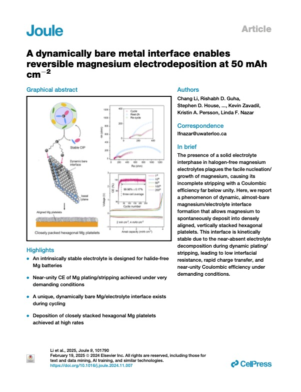 </a>

::: pub-text
<strong> Chang Li, Rishabh D. Guha, Stephen D. House, J. David Bazak, Yue Yu, Laidong Zhou, Kevin Zavadi, Kristin A. Persson and Linda F. Nazar📧</strong>  <em> A dynamically bare metal interface enables reversible magnesium electrodeposition at 50 mAh cm-2 </em>  Joule 2025, [DOI: 10.1016/j.joule.2024.11.007](https://doi.org/10.1016/j.joule.2024.11.007)
:::
::::

:::: pub-item
<a href="publications/BeforeJoiningWestlake/CEPE-Mg-electrolyte_EES2024.pdf" target="_blank"> 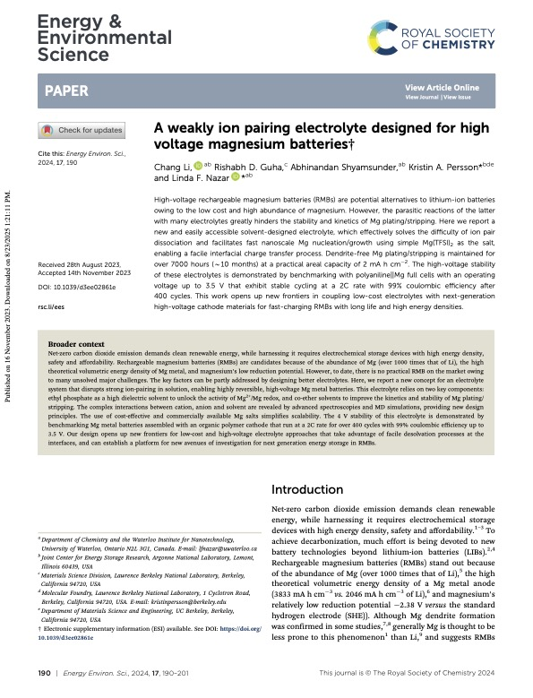 </a>

::: pub-text
<strong> Chang Li, Rishabh D. Guha, Abhinandan Shyamsunder, Kristin A. Persson📧 and Linda F. Nazar📧</strong>  <em> A weakly ion pairing electrolyte designed for high voltage magnesium batteries </em>  Energy Environ. Sci. 2024, [DOI: 10.1039/d3ee02861e](https://doi.org/10.1039/D3EE02861E)
:::
::::

:::: pub-item
<a href="publications/BeforeJoiningWestlake/Amorphous-NaTaOCl4_ACSEnergyLett2024.pdf" target="_blank"> 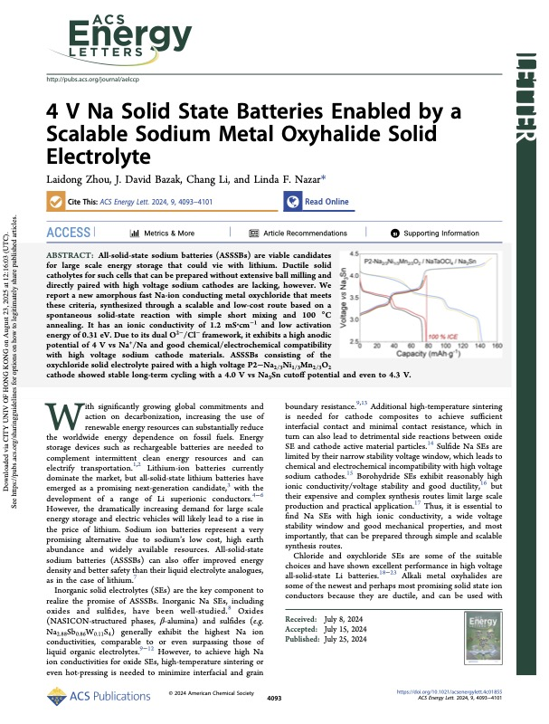 </a>

::: pub-text
<strong> Laidong Zhou, J. David Bazak, Chang Li, and Linda F.Nazar📧</strong>  <em> 4 V Na Solid State Batteries Enabled by a Scalable Sodium Metal Oxyhalide Solid Electrolyte </em>  ACS Energy Lett. 2024, [DOI: 10.1021/acsenergylett.4c01855](https://doi.org/10.1021/acsenergylett.4c01855)
:::
::::

:::: pub-item
<a href="publications/BeforeJoiningWestlake/Zeolite-membrane-Mg_Joule2023.pdf" target="_blank"> 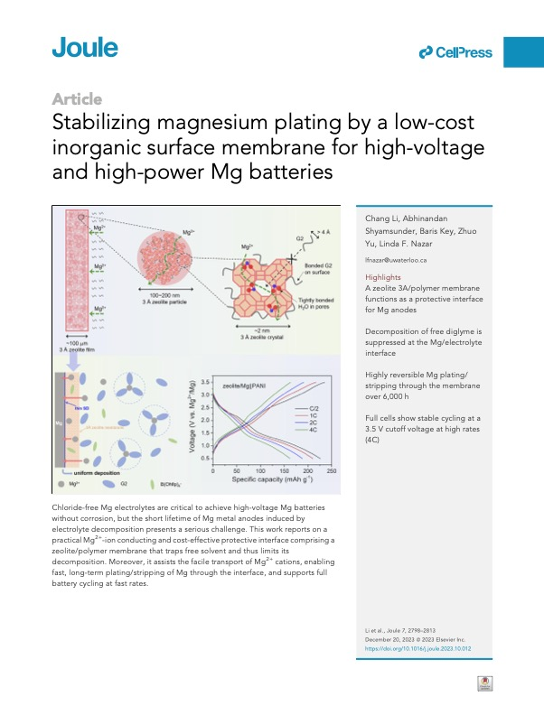 </a>

::: pub-text
<strong> Chang Li, Abhinandan Shyamsunder, Baris Key, Zhuo Yu and Linda F. Nazar📧</strong>  <em> Stabilizing magnesium plating by a low-cost inorganic surface membrane for high-voltage and high-power Mg batteries </em>  Joule 2023, [DOI: 10.1016/j.joule.2023.10.012](https://doi.org/10.1016/j.joule.2023.10.012)
:::
::::

:::: pub-item
<a href="publications/BeforeJoiningWestlake/Hybrid-eutectic-electrolyte-anodefree_NatCommun2023.pdf" target="_blank"> 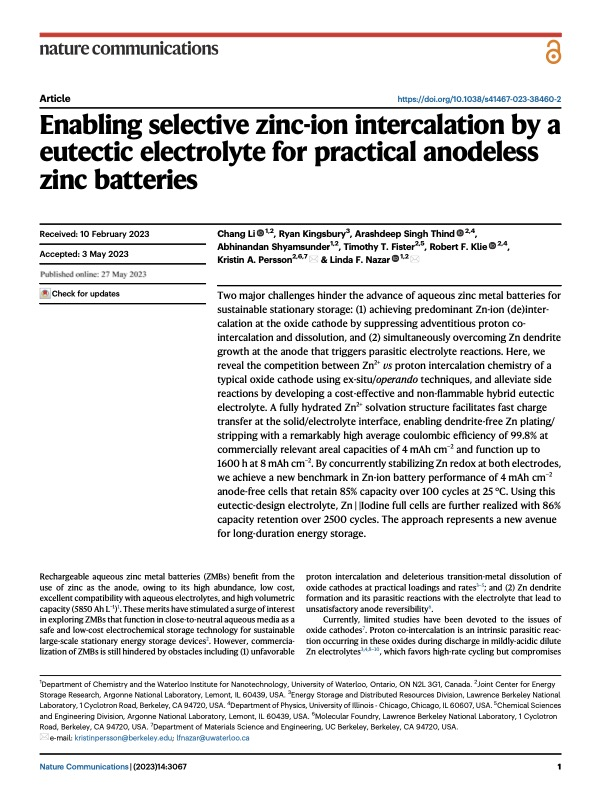 </a>

::: pub-text
<strong> Chang Li, Ryan Kingsbury, Arashdeep Singh Thind, Abhinandan Shyamsunder, Timothy T. Fister, Robert F. Klie, Kristin A. Persson📧 and Linda F. Nazar📧</strong>  <em> Enabling selective zinc-ion intercalation by a eutectic electrolyte for practical anodeless zinc batteries </em>  Nat. Commun. 2023, [DOI: 10.1038/s41467-023-38460-2](https://doi.org/10.1038/s41467-023-38460-2)
:::
::::

:::: pub-item
<a href="publications/BeforeJoiningWestlake/Na3B5S9_AngewChemIntEd2023.pdf" target="_blank"> 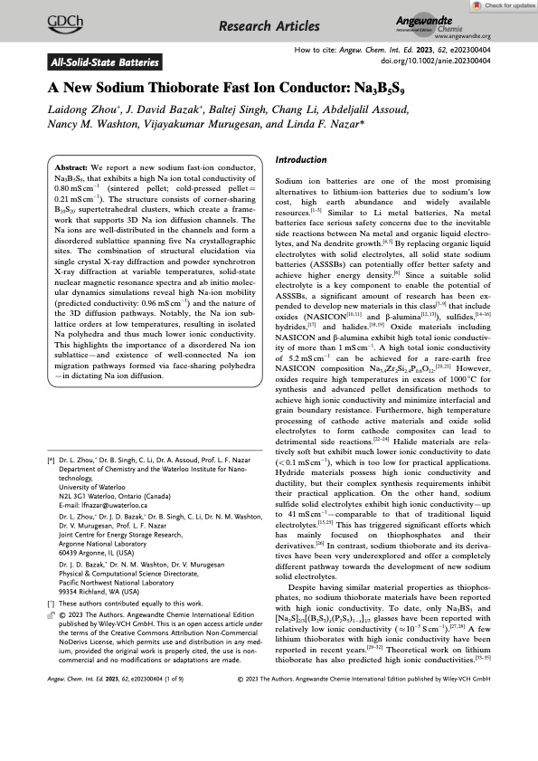 </a>

::: pub-text
<strong> Laidong Zhou, J.David Bazak, Baltej Singh, Chang Li, Abdeljalil Assoud, Nancy M.Washton, Vijayakumar Murugesan and Linda F.Nazar📧</strong>  <em> A New Sodium Thioborate Fast Ion Conductor: Na3B5S9 </em>  Angew. Chem. Int. Ed. 2023, [DOI: 10.1002/anie.202300404](https://doi.org/10.1002/anie.202300404)
:::
::::

:::: pub-item
<a href="publications/BeforeJoiningWestlake/Waxing-Cathode-SSB_ACSEnergyLett2023.pdf" target="_blank"> 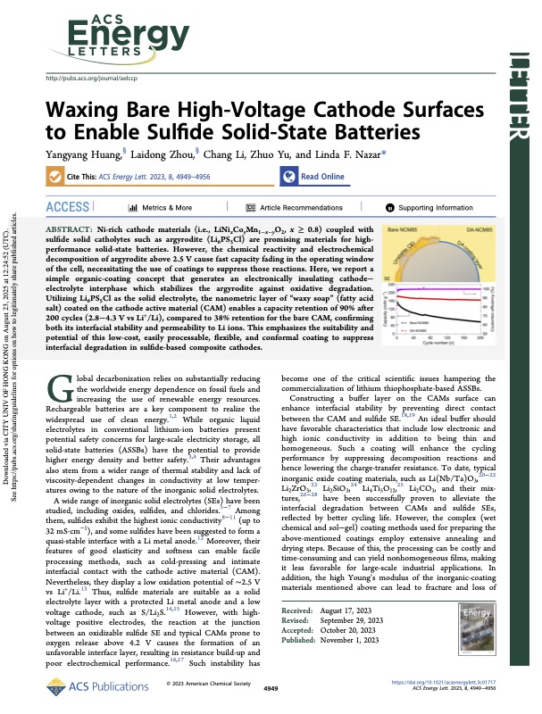 </a>

::: pub-text
<strong> Yangyang Huang, Laidong Zhou, Chang Li, Zhuo Yu and Linda F.Nazar📧</strong>  <em> Waxing Bare High-Voltage Cathode Surfaces to Enable Sulfide Solid-State Batteries </em>  ACS Energy Lett. 2023, [DOI: 10.1021/acsenergylett.3c01717](https://doi.org/10.1021/acsenergylett.3c01717)
:::
::::

:::: pub-item
<a href="publications/BeforeJoiningWestlake/Li3−xZrx(Ho-Lu)1−xCl6_ACSEnergyLett2023.pdf" target="_blank"> 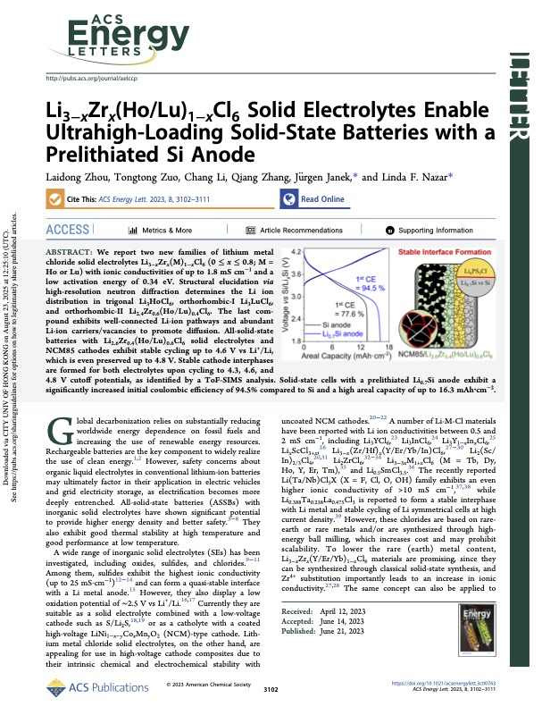 </a>

::: pub-text
<strong> Laidong Zhou, Tongtong Zuo, Chang Li, Qiang Zhang, Jürgen Janek📧 and Linda F.Nazar📧</strong>  <em> Li3−xZrx(Ho/Lu)1−xCl6 Solid Electrolytes Enable Ultrahigh-Loading Solid-State Batteries with a Prelithiated Si Anode </em>  ACS Energy Lett. 2023, [DOI: 10.1021/acsenergylett.3c00763](https://doi.org/10.1021/acsenergylett.3c00763)
:::
::::

:::: pub-item
<a href="publications/BeforeJoiningWestlake/Ca–Na-NaSICON-NVP_ChemMater2023.pdf" target="_blank"> 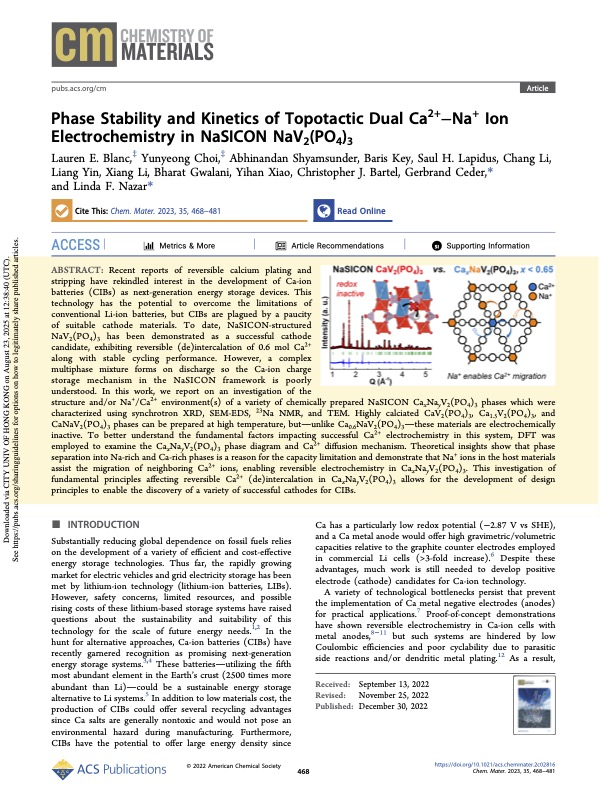 </a>

::: pub-text
<strong> Lauren E. Blanc, Yunyeong Choi, Abhinandan Shyamsunder, Baris Key, Saul H. Lapidus, Chang Li, Liang Yin, Xiang Li, Bharat Gwalani, Yihan Xiao, Christopher J. Bartel, Gerbrand Ceder📧 and Linda F.Nazar📧</strong>  <em> Phase Stability and Kinetics of Topotactic Dual Ca2+−Na+ Ion Electrochemistry in NaSICON NaV2(PO4)3 </em>  Chem. Mater. 2023, [DOI: 10.1021/acs.chemmater.2c02816](https://doi.org/10.1021/acs.chemmater.2c02816)
:::
::::

:::: pub-item
<a href="publications/BeforeJoiningWestlake/ZIB-commentary_Joule2022.pdf" target="_blank"> 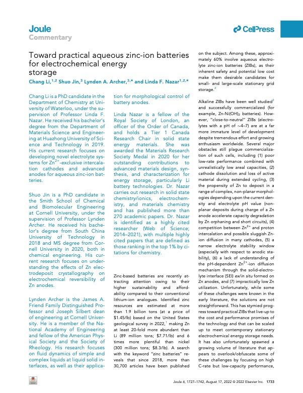 </a>

::: pub-text
<strong> Chang Li, Shuo Jin, Lynden A. Archer📧 and Linda F. Nazar📧</strong>  <em> Toward practical aqueous zinc-ion batteries for electrochemical energy storage </em>  Joule 2022, [DOI: 10.1016/j.joule.2022.06.002](https://doi.org/10.1016/j.joule.2022.06.002)
:::
::::

:::: pub-item
<a href="publications/BeforeJoiningWestlake/DOTF-additive_Joule2022.pdf" target="_blank"> 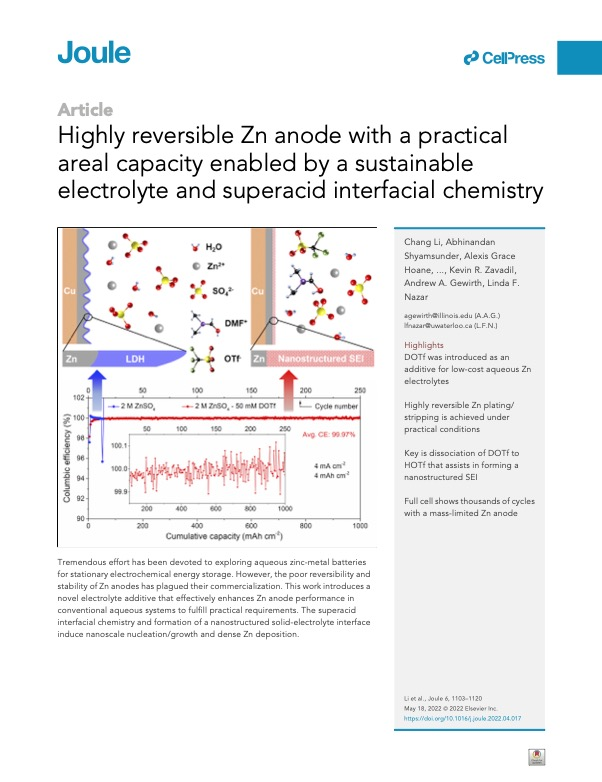 </a>

::: pub-text
<strong> Chang Li, Abhinandan Shyamsunder,cAlexis Grace Hoane, Daniel M. Long, Chun Yuen Kwok, Paul G. Kotula, Kevin R. Zavadil, Andrew A. Gewirth📧 and Linda F. Nazar📧</strong>  <em> Highly reversible Zn anode with a practical areal capacity enabled by a sustainable electrolyte and superacid interfacial chemistry </em>  Joule 2022, [DOI: 10.1016/j.joule.2022.04.017](https://doi.org/10.1016/j.joule.2022.04.017)
:::
::::

:::: pub-item
<a href="publications/BeforeJoiningWestlake/Proton-Intercation-PEG_ACSEnergyLett2022.pdf" target="_blank"> 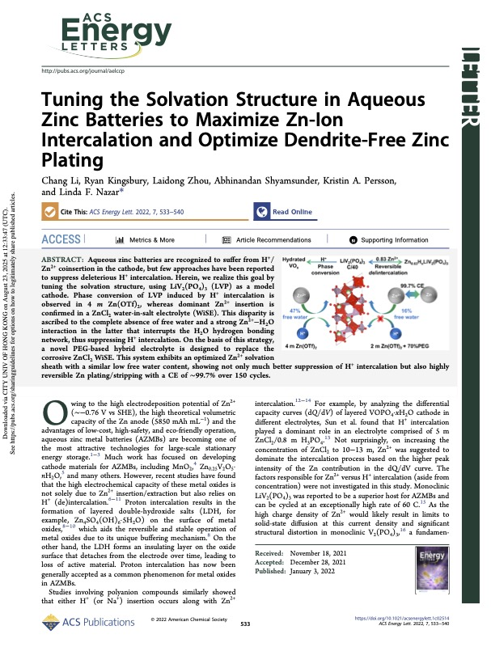 </a>

::: pub-text
<strong> Chang Li, Ryan Kingsbury, Laidong Zhou, Abhinandan Shyamsunder, Kristin A. Persson and Linda F. Nazar📧</strong>  <em> Tuning the Solvation Structure in Aqueous Zinc Batteries to Maximize Zn-Ion Intercalation and Optimize Dendrite-Free Zinc Plating </em>  ACS Energy Lett. 2022, [DOI: 10.1021/acsenergylett.1c02514](https://doi.org/10.1021/acsenergylett.1c02514)
:::
::::

:::: pub-item
<a href="publications/BeforeJoiningWestlake/ZnV2O4_NanoEnergy2020.pdf" target="_blank"> 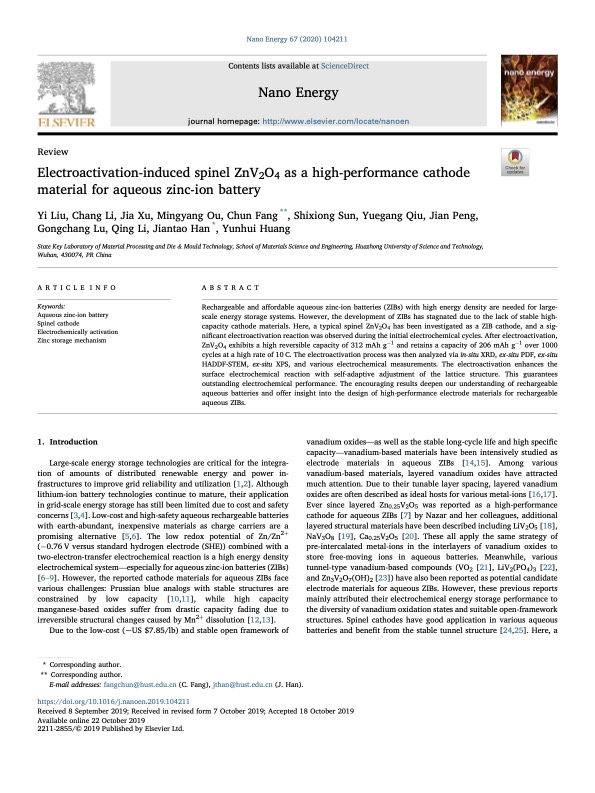 </a>

::: pub-text
<strong> Yi Liu, Chang Li, Jia Xu, Mingyang Ou, Chun Fang, Shixiong Sun, Yuegang Qiu, Jian Peng, Gongchang Lu, Qing Li, Jiantao Han📧, Yunhui Huang</strong>  <em> Electroactivation-induced spinel ZnV2O4 as a high-performance cathode material for aqueous zinc-ion battery </em>  Nano Energy 2020, [DOI: 10.1016/j.nanoen.2019.104211](https://doi.org/10.1016/j.nanoen.2019.104211)
:::
::::

:::: pub-item
<a href="publications/BeforeJoiningWestlake/Core-Shell-PBAs_ChemSusChem2019.pdf" target="_blank"> 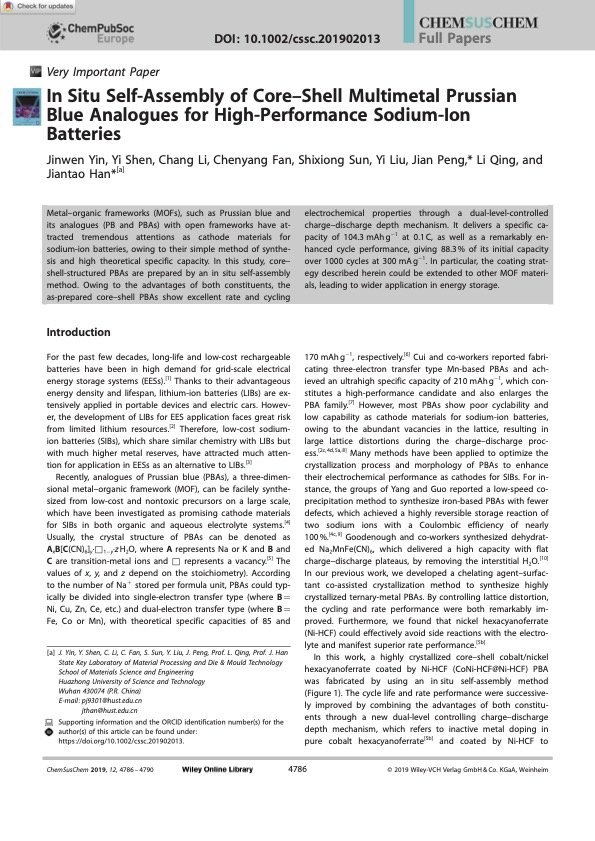 </a>

::: pub-text
<strong> Jinwen Yin†, Yi Shen†, Chang Li†, Chenyang Fan, Shixiong Sun, Yi Liu, Jian Peng📧, Li Qing and Jiantao Han📧</strong>  <em> In Situ Self-Assembly of Core–Shell Multimetal Prussian Blue Analogues for High-Performance Sodium-Ion Batteries </em>  ChemSusChem 2019, [DOI: 10.1002/cssc.201902013](https://doi.org/10.1002/cssc.201902013)
:::
::::

:::: pub-item
<a href="publications/BeforeJoiningWestlake/Ce-PBAs_ACSApplEngMater_2019.pdf" target="_blank"> 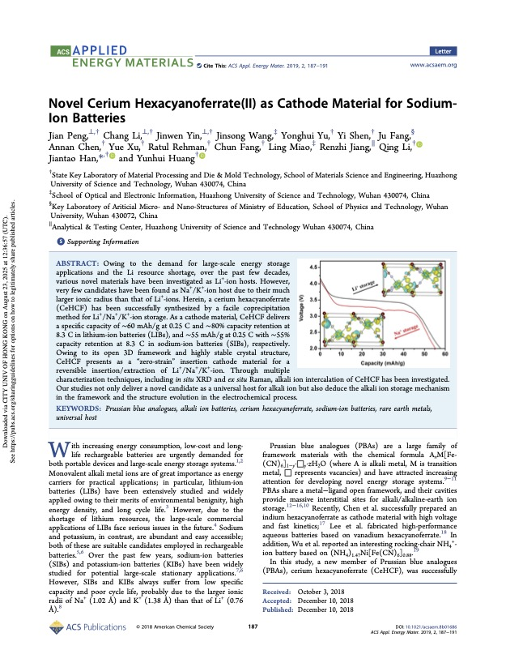 </a>

::: pub-text
<strong> Jian Peng,† Chang Li,† Jinwen Yin,† Jinsong Wang, Yonghui Yu, Yi Shen, Ju Fang, Annan Chen, Yue Xu, Ratul Rehman, Chun Fang, Ling Miao, Renzhi Jiang, Qing Li, Jiantao Han📧, and Yunhui Huang</strong>  <em> Novel Cerium Hexacyanoferrate(II) as Cathode Material for Sodium-Ion Batteries </em>  ACS Appl. Energy Mater. 2019, [DOI: 10.1021/acsaem.8b01686](http://dx.doi.org/10.1021/acsaem.8b01686)
:::
::::

:::: pub-item
<a href="publications/BeforeJoiningWestlake/Ti-Substitution-Na3V2(PO4)3_ESM2018.pdf" target="_blank"> 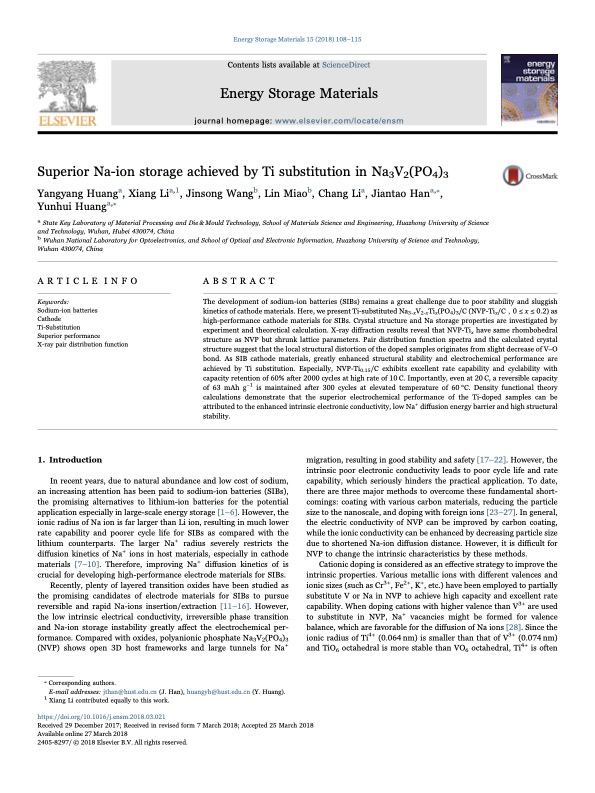 </a>

::: pub-text
<strong> Yangyang Huang, Xiang Li,, Jinsong Wang, Lin Miao, Chang Li, Jiantao Han📧 and Yunhui Huang📧</strong>  <em> Superior Na-ion storage achieved by Ti substitution in Na3V2(PO4)3 </em>  Energy Storage Materials 2018, [DOI: 10.1016/j.ensm.2018.03.021](https://doi.org/10.1016/j.ensm.2018.03.021)
:::
::::

## Seminar Presentations

:::: pub-item

::: pub-text
<strong> Chang Li and Linda F. Nazar </strong>  <em> Electrode/Electrolyte Interface Control for Multivalent-Ion Batteries with High Stability and Reversibility </em>  Materials Research Society (MRS) Fall Meeting 2023, Boston, Nov. 27th, 2023
:::
::::